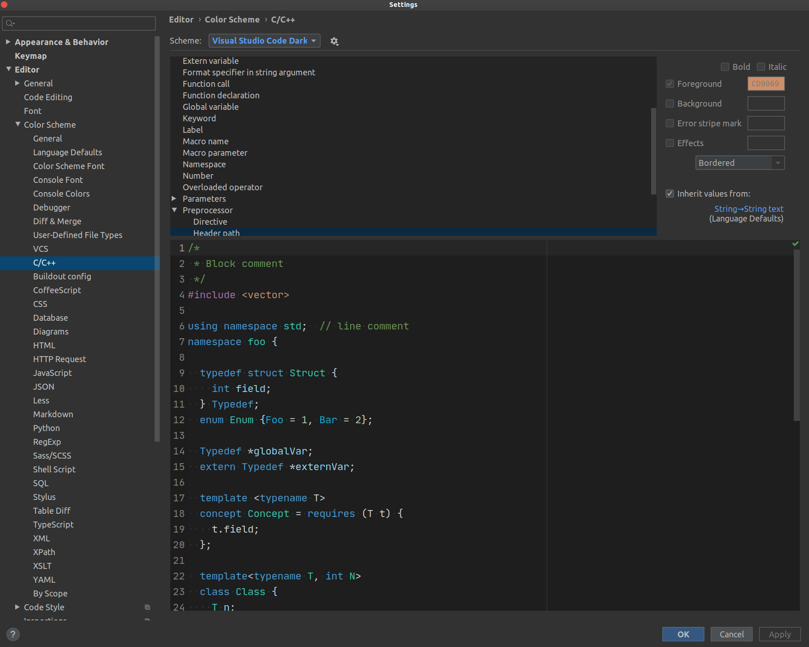

### 简介/Introduction

+ 这是一个用于clion的vscode_dark代码高亮主题的设置, 建议配合clion中visual studio dark plus theme一起食用
+ visual studio dark plus theme 这个插件本身的高亮设置已经很好, 但是我还是更喜欢vs的默认风格, 因此对照原来的风格修改了一下高亮设置, 部分细节会有不同, 但自认为还是比较还原.
+ This is a VSCode-cpp-color-scheme for clion, and it had better be used with visual_studio_dark_plus_theme which you can find in clion plugin market place.
  
### 预览/overview

### 使用方法/Usage

+ 下载到本地后, 打开clion找到files -> settings -> Editor -> Color Scheme
然后点击上方Scheme右侧齿轮按钮, 选择插入主题即可.
+ 除了clion, 其它JetBrains系的IDE也支持此文件. 
+ Download this repo or .icls file, then open clon and get files -> settings -> Editor -> Color Scheme. Then click the gear-like button on the right side of scheme and select the insert-theme item.
+ Except for clion, other JetBrains ide also support this file.

